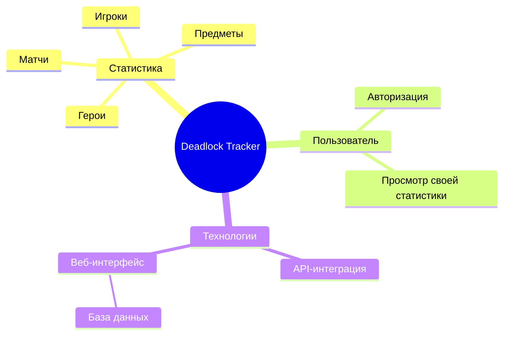
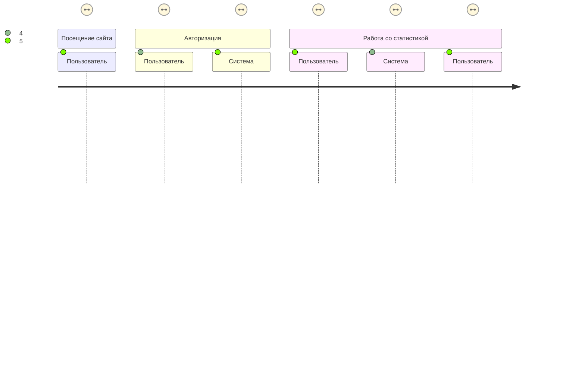
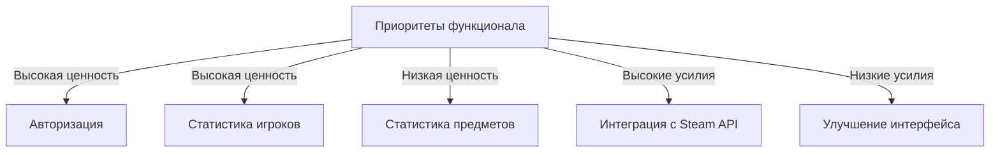

# Deadlock Tracker Documentation

## Описание проекта

Deadlock Tracker — это веб-платформа для отслеживания игровой статистики популярной игры **Deadlock**. Пользователи могут просматривать:
- Статистику матчей.
- Детальную статистику героев, предметов и сборок.
- Статистику других игроков.
- Свою собственную статистику (доступно только для авторизованных пользователей).

Система интегрируется с **Steam API** для получения данных и сохраняет обработанную информацию в базе данных для последующего отображения.

---

## Структура функциональных возможностей


## Путешествие пользователя Deadlock Tracker

## Приоритеты функционала

## История разработки
```mermaid
gitGraph
   commit id: "Initialize project"
   branch develop
   checkout develop
   commit id: "Set up CI/CD pipeline"
   commit id: "Create API Gateway project"
   branch feature/user-service
   checkout feature/user-service
   commit id: "Implement UserService"
   commit id: "Write Unit Tests for UserService"
   checkout develop
   merge feature/user-service id: "Merge UserService to develop"
   branch feature/frontend-auth
   checkout feature/frontend-auth
   commit id: "Develop Frontend Authentication Module"
   checkout develop
   merge feature/frontend-auth id: "Merge Frontend Auth Module to develop"
   branch feature/stats-service
   checkout feature/stats-service
   commit id: "Implement StatsService"
   commit id: "Write Integration Tests for StatsService"
   checkout develop
   merge feature/stats-service id: "Merge StatsService to develop"
   branch feature/steam-service
   checkout feature/steam-service
   commit id: "Develop SteamService"
   commit id: "Integrate with External Steam API"
   checkout develop
   merge feature/steam-service id: "Merge SteamService to develop"
   branch feature/frontend-ui
   checkout feature/frontend-ui
   commit id: "Enhance Frontend UI (Responsive Design)"
   commit id: "Display User Stats on Frontend"
   checkout develop
   merge feature/frontend-ui id: "Merge Frontend UI enhancements to develop"
   branch feature/db-optimization
   checkout feature/db-optimization
   commit id: "Improve Database Schema for Performance"
   checkout develop
   merge feature/db-optimization id: "Merge DB optimization to develop"
   branch staging
   checkout staging
   commit id: "Deploy to Staging Environment"
   branch main
   checkout main
   merge staging id: "Merge Staging to Main"
   commit id: "Release version 1.0"

   branch hotfix/fix-frontend-bug
   checkout hotfix/fix-frontend-bug
   commit id: "Fix critical bug in frontend"
   checkout main
   merge hotfix/fix-frontend-bug id: "Merge Hotfix to Main"
   checkout develop
   merge hotfix/fix-frontend-bug id: "Merge Hotfix to Develop"
```
