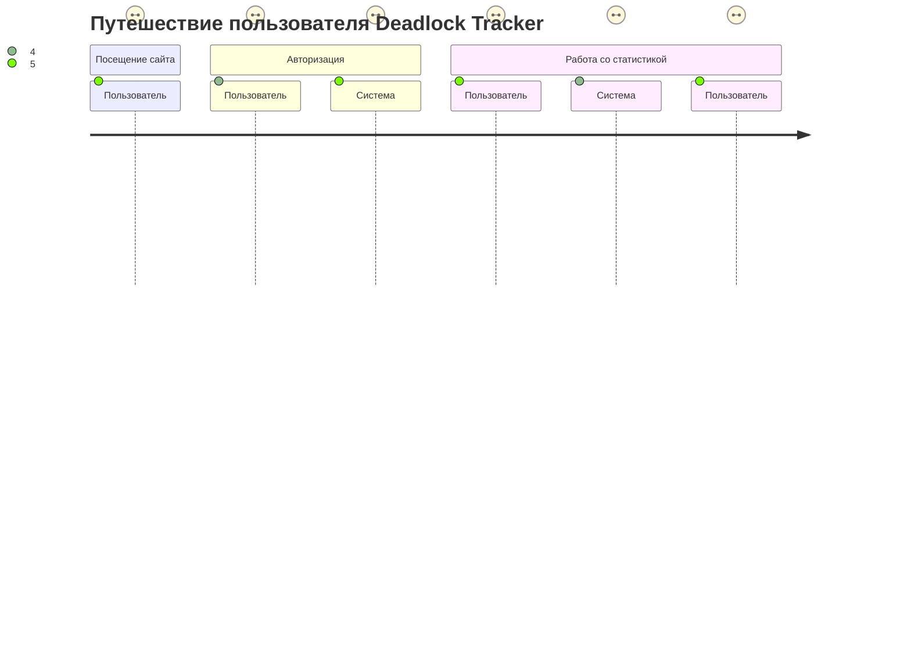

# Deadlock Tracker Documentation

## Описание проекта

Deadlock Tracker — это веб-платформа для отслеживания игровой статистики популярной игры **Deadlock**. Пользователи могут просматривать:
- Статистику матчей.
- Детальную статистику героев, предметов и сборок.
- Статистику других игроков.
- Свою собственную статистику (доступно только для авторизованных пользователей).

Система интегрируется с **Steam API** для получения данных и сохраняет обработанную информацию в базе данных для последующего отображения.

---

## Структура функциональных возможностей

